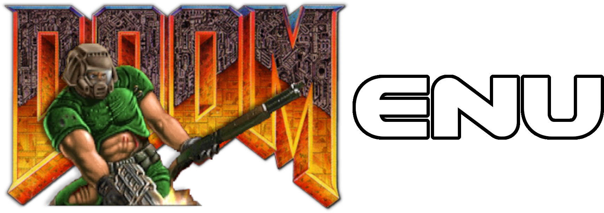

A dmenu implementation for loading doom wads and source ports

```
usage: doomenu [SOURCE_PORT] [IWAD] [nopwad]
Options:

SOURCE_PORT options:
  prboom, prboom-plus                         PRBoom ports
  gzdoom, qzdoom, zdoom                       ZDoom ports
  chocolate                                   Chocolate ports
  crispy                                      Crispy Doom port

IWAD options:
  doom, doom2, tnt, evilution, plutonia       Doom (1, 2, Evilution, Project Plutonia)
  strife, strifeve                            Strife (Demo, Veteran's Edition)
  heretic                                     Heretic
  freedoom1, freedoom2, freedm                Freedoom (Phase 1, 2, Deathmatch)
  hexen, hexdd                                Hexen
  chex3                                       Chex Quest
  hacx
  harmony

Misc Options:
  nopwad                                      Skip PWAD select
  help                                        Show this stuff
```
